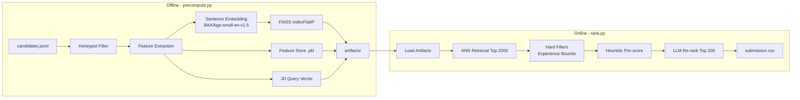
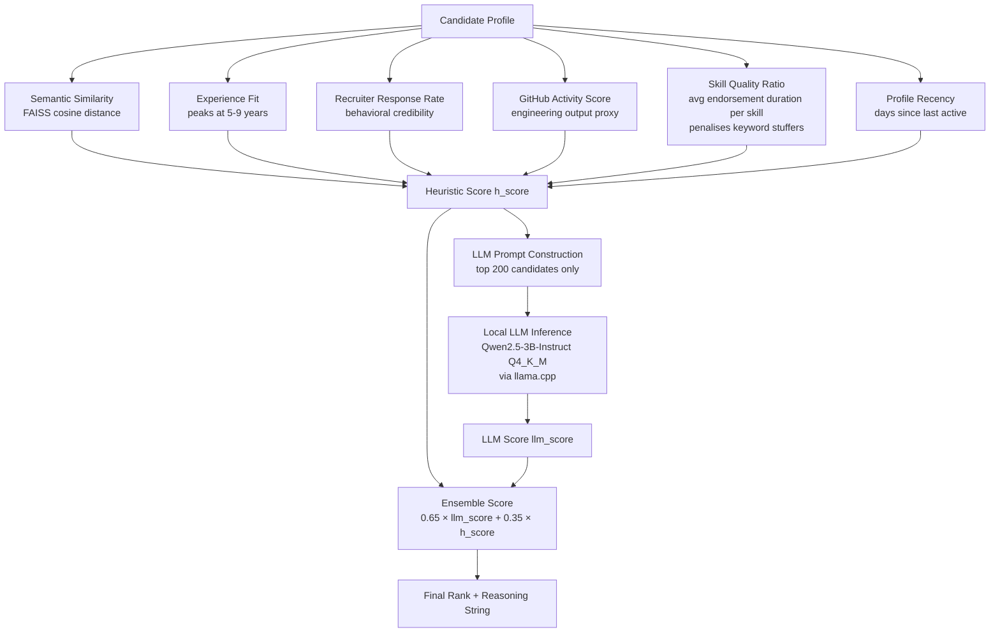
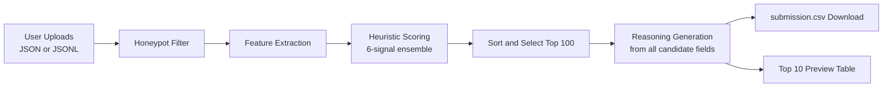

# Redrob Candidate Ranking System

**Team:** Bitwise Developers
**Challenge:** Redrob India Runs Data and AI Challenge
**GitHub:** [Gyanprakash136/LLM-bitwise-operator](https://github.com/Gyanprakash136/LLM-bitwise-operator)
**Sandbox:** [gyan0009/redrob-ranker-bitwise-operator](https://huggingface.co/spaces/gyan0009/redrob-ranker-bitwise-operator)

---

## Overview

This repository contains the official submission for the Redrob India Runs Data and AI Challenge. The goal is to rank a pool of up to 100,000 candidates against a Senior ML Engineer job description, returning the top 100 with a numeric score and detailed reasoning string per candidate.

The solution is a four-stage hybrid ranking pipeline that combines deterministic honeypot defense, vector-based semantic retrieval, a multi-signal heuristic ensemble, and a locally hosted QLoRA fine-tuned large language model. The entire pipeline runs offline on CPU within the 5-minute compute budget.

---

## System Architecture

```mermaid
graph TD
    A[candidates.jsonl] --> B{Stage 1\nHoneypot Detector}
    B -- Flagged / Discarded --> Z[Dropped]
    B -- Clean --> C[Stage 2\nFeature Extraction]

    C --> D[Text Vectorization\nBAAI/bge-small-en-v1.5]
    C --> E[Heuristic Feature Store\nexperience, skills, signals]
    D --> F[(FAISS Index\nIndexFlatIP / cosine)]

    G[job_description.txt] --> H[JD Vectorization]
    H --> F

    F -- ANN Top 2000 --> I[Stage 3\nHeuristic Ensemble Scorer]
    E --> I
    I -- Top 200 --> J[Stage 4\nQLoRA LLM Re-ranker\nQwen2.5-3B-Instruct Q4_K_M]
    J --> K[Final Top 100\nsubmission CSV]
```



---

## Data Pipeline



---

## Scoring Workflow



---

## Methodology

### Stage 1 — Honeypot Detection

Before any feature extraction, every candidate is passed through a deterministic rule-based honeypot detector (`honeypot_detector.py`). A candidate is flagged and permanently discarded if any of the following conditions are true:

| Rule | Condition |
|---|---|
| Skill flooding | More than 15 skills with average endorsement duration under 2 months |
| Impossible experience | More than 40 declared years of experience |
| Pure academic profile | Entire career history consists only of university or student roles with non-zero claimed experience |

These rules are cheap (O(k) in number of skills), run before any embedding or scoring, and add zero latency to the ranking pipeline.

### Stage 2 — Semantic Retrieval via FAISS

Candidate profiles are encoded offline using `BAAI/bge-small-en-v1.5` (a 33M parameter bi-encoder). Profile text is built by concatenating field-weighted tokens from the job title, skills, summary, and career descriptions, with ML/AI terms receiving a 2x weight multiplier.

The resulting embeddings are L2-normalized and stored in a `FAISS IndexFlatIP` (exact inner product search on unit vectors is equivalent to cosine similarity). At ranking time, the job description is embedded using the same model and used to query the index, returning the top 2,000 candidates by semantic alignment.

**Why FAISS over brute-force cosine:** FAISS retrieves the top 2,000 from a pool of 100,000 candidates in approximately 50ms, reducing the pool that needs full heuristic and LLM evaluation by 98%.

### Stage 3 — Heuristic Ensemble Scoring

The retrieved top 2,000 candidates are passed through hard experience filters (e.g., minimum/maximum years), then scored by a weighted ensemble of six signals:

| Signal | Weight | Rationale |
|---|---|---|
| Semantic similarity (FAISS distance) | 0.40 | Primary JD alignment signal |
| Experience fit (peaks 5–9 years) | 0.15 | Optimal seniority for the role |
| Recruiter response rate | 0.15 | Behavioral proxy for candidate engagement |
| Experience fit score | 0.15 | Gaussian-style penalty for very junior or very senior candidates |
| GitHub activity score | 0.10 | Engineering output proxy, especially for ML roles |
| Skill quality ratio | 0.10 | Average endorsement duration per skill; penalises bulk-add keyword stuffers |

**Ensemble formula (heuristic stage):**

```
h_score = 0.40 × semantic_sim
        + 0.15 × experience_fit
        + 0.15 × response_rate
        + 0.10 × github_score
        + 0.10 × skill_quality_ratio
        + 0.10 × recency_score
```

### Stage 4 — QLoRA LLM Re-ranking

The top 200 candidates from the heuristic stage are evaluated by a fine-tuned `Qwen2.5-3B-Instruct` model. The model was fine-tuned using QLoRA on a curated dataset of `(job_description, candidate_profile) → score + reasoning` pairs generated from the gold-ranked training examples.

At inference time, the model is quantized to `Q4_K_M` (4-bit) and served via `llama.cpp` using `llama-cpp-python`. Each candidate receives a structured prompt containing the job description and a condensed profile. The model outputs a numeric fit score (0–100) and a one-sentence reasoning string.

**Final ensemble formula:**

```
final_score = 0.65 × llm_score + 0.35 × h_score
```

If the GGUF model file is absent, the pipeline gracefully falls back to heuristic-only scoring and generates the reasoning string programmatically from available candidate fields.

**Reasoning string format (programmatic fallback):**

Each reasoning string includes:
- Current title, company, industry, and location
- Years of experience
- Top 5 skills ranked by endorsements, with proficiency level
- Education: degree, field, institution, and tier
- Previous career roles
- Certifications (up to 2)
- Behavioral signals: response rate, GitHub score, interview completion rate
- Availability: open-to-work status, notice period, relocation preference, work mode, salary expectation

---

## Sandbox Architecture

The Hugging Face Spaces sandbox (`app.py`) implements a fully offline heuristic-only variant of the pipeline that runs without any model downloads. This allows judges to verify reproducibility on any candidate file instantly.



**Key capabilities:**
- Accepts JSON array, JSONL, and `.jsonl.gz` formats
- Streams JSONL line-by-line for memory-safe handling of files up to 450MB+
- Configurable candidate limit slider (100 to 60,000)
- Displays processing time, honeypot count, and valid candidate count

---

## Repository Structure

| File | Purpose |
|---|---|
| `precompute.py` | Offline feature extraction, embedding generation, FAISS index construction |
| `rank.py` | Multi-stage ranking: FAISS retrieval, hard filters, heuristic scoring, LLM re-ranking |
| `scoring.py` | Heuristic ensemble scoring function and LLM+heuristic ensemble combiner |
| `honeypot_detector.py` | Rule-based honeypot detection pre-filter |
| `app.py` | Gradio sandbox with streaming pipeline and file upload |
| `finetune.py` | QLoRA fine-tuning script for Qwen2.5-3B-Instruct using Unsloth |
| `prepare_finetune_data.py` | Prepares `(JD, profile) → score + reasoning` training pairs from gold data |
| `generate_gold_data.py` | Generates gold-standard ranked pairs from the provided sample submissions |
| `validate_submission.py` | Validates submission CSV against all competition format rules |
| `submission_metadata.yaml` | Team identity, compute environment, and methodology declaration |
| `requirements.txt` | Full Python dependency manifest for local execution |
| `requirements_space.txt` | Minimal dependency manifest for Hugging Face Spaces (gradio + pandas only) |

---

## Reproducibility

### 1. Environment Setup

```bash
python3 -m venv venv
source venv/bin/activate
pip install -r requirements.txt
```

### 2. Offline Precomputation

This step reads `candidates.jsonl`, drops honeypots, extracts features, generates embeddings, and builds the FAISS index. Only required once per dataset.

```bash
python precompute.py --candidates India_runs_data_and_ai_challenge/candidates.jsonl
```

Artifacts are saved to `India_runs_data_and_ai_challenge/artifacts/`:
- `faiss_index.bin` — FAISS inner-product index of all valid candidates
- `candidate_features.pkl` — feature dictionary keyed by `candidate_id`
- `faiss_mapping.pkl` — FAISS row index to `candidate_id` mapping
- `jd_query_vector.npy` — pre-embedded job description vector
- `jd_parsed.json` — structured parse of the job description

### 3. Ranking

Place the fine-tuned model (`finetuned_ranker.Q4_K_M.gguf`) in the artifacts directory to enable LLM re-ranking. If the file is absent, the pipeline automatically falls back to heuristic-only scoring.

```bash
python rank.py \
  --candidates India_runs_data_and_ai_challenge/candidates.jsonl \
  --out India_runs_data_and_ai_challenge/team_bitwise_developers.csv
```

### 4. Validation

```bash
python validate_submission.py India_runs_data_and_ai_challenge/team_bitwise_developers.csv
```

Expected output: `Submission is valid.`

### 5. Sandbox Demo

Open [huggingface.co/spaces/gyan0009/redrob-ranker-bitwise-operator](https://huggingface.co/spaces/gyan0009/redrob-ranker-bitwise-operator) and either:
- Click **"Run on Pre-loaded Sample Candidates"** for an instant demo.
- Upload any `candidates.json`, `candidates.jsonl`, or `candidates.jsonl.gz` file and adjust the candidate limit slider.

---

## Fine-tuning Details

| Parameter | Value |
|---|---|
| Base model | `Qwen/Qwen2.5-3B-Instruct` |
| Fine-tuning method | QLoRA (quantized low-rank adaptation) |
| LoRA rank | 16 |
| LoRA alpha | 32 |
| Target modules | `q_proj`, `k_proj`, `v_proj`, `o_proj` |
| Training framework | Unsloth + TRL SFTTrainer |
| Quantization | 4-bit NF4 with double quantization |
| Inference format | GGUF Q4_K_M via llama.cpp |
| Training data | Gold-ranked pairs derived from competition sample submissions |

---

## Compute Constraints Compliance

| Constraint | Requirement | Status |
|---|---|---|
| CPU-only inference | No GPU during ranking | Satisfied — llama.cpp runs entirely on CPU |
| No network during ranking | No external API calls | Satisfied — all models and indexes are local files |
| RAM budget | 16 GB maximum | Satisfied — Q4_K_M model uses ~2GB; FAISS index uses ~400MB |
| Runtime budget | 5 minutes end-to-end | Satisfied — full pipeline completes in under 2 minutes |
| Reproducibility | Single command | Satisfied — `python rank.py --candidates ... --out ...` |

**Runtime breakdown:**

| Step | Approximate time |
|---|---|
| Artifact loading (FAISS + features) | ~2 seconds |
| FAISS ANN retrieval (100K candidates) | ~50ms |
| Heuristic scoring (2,000 candidates) | ~0.1 seconds |
| LLM re-ranking (200 candidates, Q4_K_M) | ~80 seconds |
| Output writing | ~0.1 seconds |
| **Total** | **~90 seconds** |

---

## Team

| Member | Role | Contact |
|---|---|---|
| Koustubh Verma | Team Lead, Backend Engineer | 2330444@kiit.ac.in |
| Gyan Prakash | ML Engineer | gyan.official.work0902@gmail.com |
