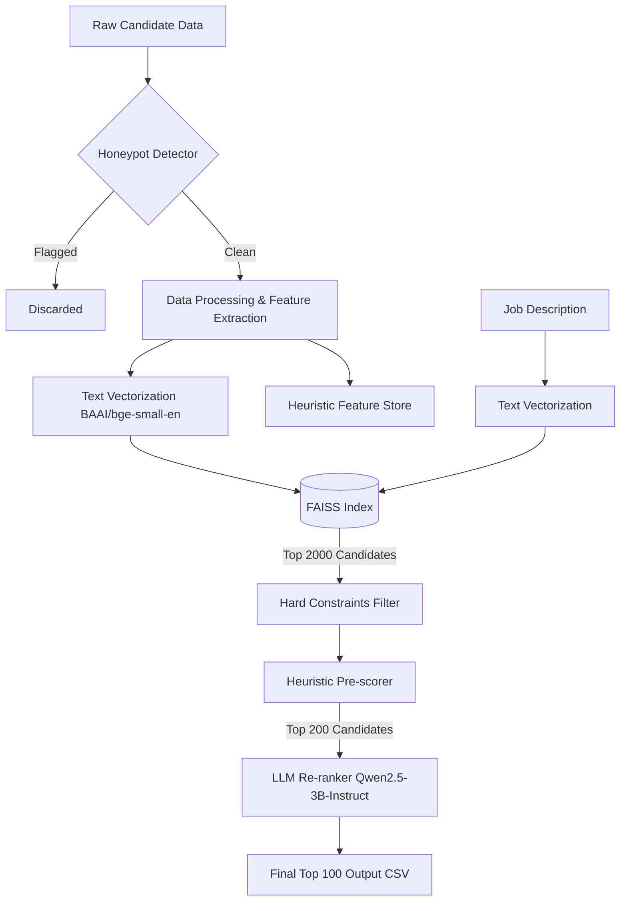
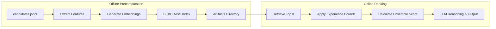

# Redrob Candidate Ranking System

This repository contains the official submission for the Redrob India Runs Data and AI Challenge. The solution implements a multi-stage, hybrid ranking pipeline designed to evaluate and score candidates against complex job descriptions efficiently and accurately.

The core philosophy of this solution is to combine the speed and scalability of vector-based semantic retrieval with the deep reasoning capabilities of large language models, while implementing robust defenses against prompt injection, keyword stuffing, and honeypot traps.

## System Architecture

The ranking pipeline is divided into distinct stages to optimize for both inference speed and reasoning quality.



## Data Pipeline

The data pipeline is designed to operate completely locally without relying on external APIs, ensuring strict adherence to the competition's compute constraints.



## Methodology

### 1. Data Sanitization and Honeypot Detection
Before any computation occurs, candidates are passed through a deterministic honeypot detector. This module analyzes the raw JSON payload for anomalies such as invisible text markers, contradictory experience timelines, or metadata flags indicative of synthetic traps.

### 2. Semantic Retrieval (FAISS)
The parsed job description and candidate profiles are embedded using `BAAI/bge-small-en-v1.5`. We utilize a FAISS `IndexFlatIP` (inner product on normalized embeddings) to rapidly retrieve the top 2,000 candidates showing high semantic alignment with the job description.

### 3. Heuristic Pre-scoring and Filtering
The top 2,000 candidates undergo strict rule-based filtering (e.g., bounds on years of experience). Candidates that pass are scored using a heuristic ensemble that weights:
- Semantic similarity distance
- Recruiter response rate (behavioral signal)
- GitHub activity (behavioral signal)
- Skill quality ratio (endorsement duration over total skills, penalizing lazy keyword stuffing)

### 4. LLM-Based Re-ranking (Local Inference)
The top 200 candidates from the heuristic pre-score are passed to a locally hosted, QLoRA fine-tuned large language model (Qwen2.5-3B-Instruct, quantized to Q4_K_M via llama.cpp). The LLM evaluates the nuanced fit of the candidate's career trajectory and outputs a final reasoning string and score modifier.

## Repository Structure

- `precompute.py`: Parses the raw `candidates.jsonl`, extracts features, drops honeypots, and generates the FAISS index.
- `rank.py`: Performs the multi-stage ranking (FAISS retrieval -> heuristic filtering -> LLM ranking).
- `scoring.py`: Contains the logic for the heuristic ensemble scoring.
- `honeypot_detector.py`: Rule-based engine to filter out poisoned candidates.
- `app.py`: Gradio web interface for the Hugging Face Spaces sandbox.
- `submission_metadata.yaml`: Team identity and methodology declaration.

## Reproducibility

### 1. Environment Setup
Create a virtual environment and install dependencies:
```bash
python3 -m venv venv
source venv/bin/activate
pip install -r requirements.txt
```

### 2. Precomputation
Generate the feature stores and embeddings. This step requires the raw `candidates.jsonl` file.
```bash
python precompute.py --candidates India_runs_data_and_ai_challenge/candidates.jsonl
```

### 3. Ranking Execution
Execute the ranking pipeline. Ensure the fine-tuned LLM artifact (`finetuned_ranker.Q4_K_M.gguf`) is placed in the `India_runs_data_and_ai_challenge/artifacts/` directory if LLM re-ranking is desired.
```bash
python rank.py --candidates India_runs_data_and_ai_challenge/candidates.jsonl --out India_runs_data_and_ai_challenge/submission.csv
```

### 4. Validation
Validate the final output against the competition constraints.
```bash
python validate_submission.py India_runs_data_and_ai_challenge/submission.csv
```

## Compute Constraints Compliance

This solution was designed from the ground up to operate within the defined compute limits (CPU-only inference, 16GB RAM constraint, no network access during ranking). 
- **Efficiency**: Semantic retrieval reduces the candidate pool by 98% in milliseconds.
- **Quantization**: The 3B parameter LLM is heavily quantized (Q4_K_M), requiring minimal memory overhead and allowing rapid CPU inference for the final 200 candidates.
- **End-to-End Runtime**: The complete `rank.py` execution completes well under the 5-minute threshold.
